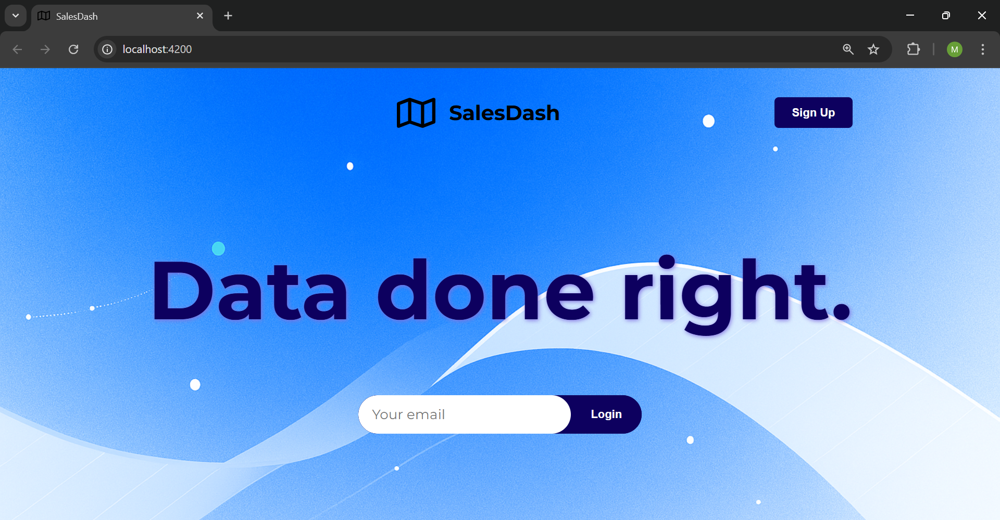
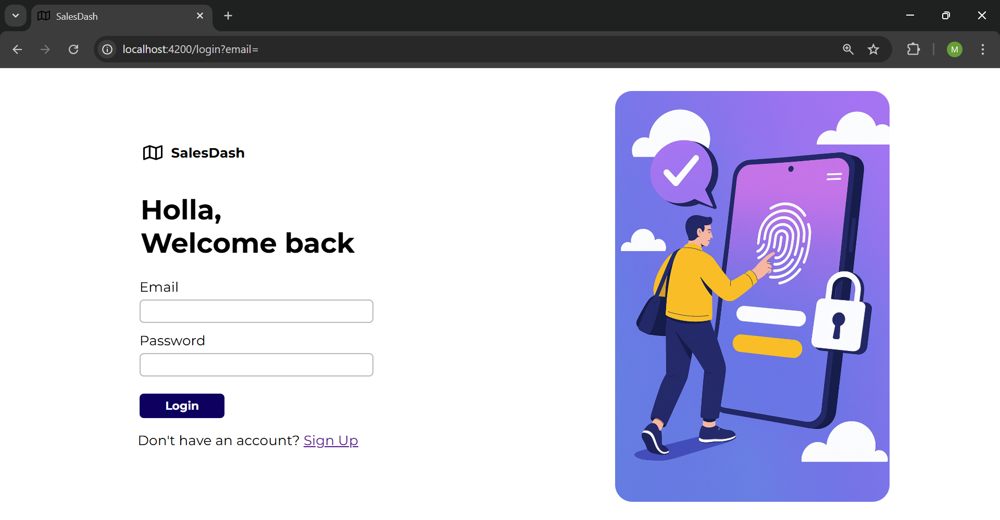
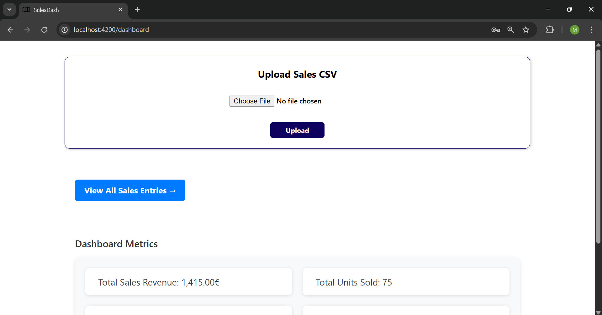
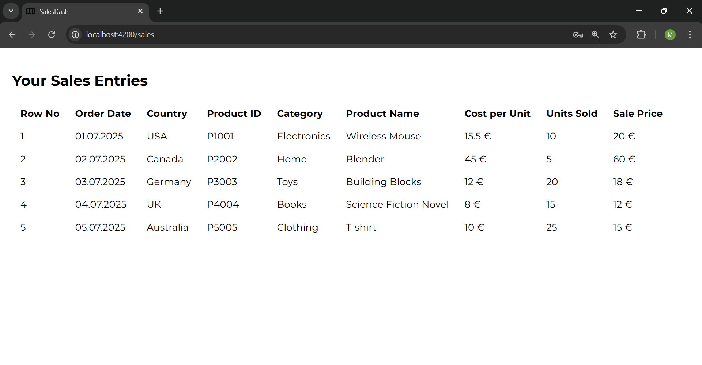

# Sales Dashboard Application

A full-stack web application that allows authenticated users to upload their sales data via CSV files and view insightful sales analytics.

---

## 🛠️ Tech Stack

Frontend: Angular (with Router, Guards, Interceptors)

Backend: Spring Boot (Spring Security, JPA, REST APIs)

Auth: JWT-based authentication

Database: PostgreSQL

---

## 🖼️ Screenshots

### 🏠 Landing Page

### 🔐 Login Page

### 📊 Dashboard

### 📄 Sales Page

---

## Features

- User Signup & Login (JWT-based authentication)
- Upload CSV files with sales records
- Visual dashboard showing key business metrics
- Detailed view of uploaded sales data

